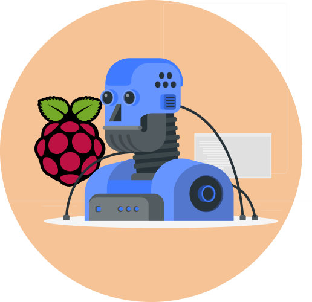

<div align='center'></div>


# Dalle Image Genernation at the finger tip (with a Raspberry Pi)

A cross platform application to allow for using Dalle OpenAI API without much coding

## Preparing Raspberry Pi

- Install any Raspberry Pi OS with [Raspberry Pi Imager](https://www.raspberrypi.com/software/)

  *Remember to setup wifi & SSH credentials*

- SSH into the Raspberry Pi & prepare the libraries
```bash
  sudo rm /usr/lib/python3.11/EXTERNALLY-MANAGED
  pip3 install openai pathlib
  git clone https://github.com/ThomasVuNguyen/openaiprojects.git
```

- Download the application at [Releases](https://github.com/ThomasVuNguyen/AccessibleAI/releases)
- Once in the app:
    - Enter the SSH Credentials & OpenAI API (*Sometimes using IP address instead of hostname works better*)
    - Enter preferred Dalle settings such as model name, resolution, quality
    - Enter the prompt and press Generate!
## License

[MIT](https://choosealicense.com/licenses/mit/)

## Credit

<a href="https://storyset.com/technology">Technology illustrations by Storyset</a>

<a href="https://iconscout.com/icons/raspberry">Raspberry by Icon Mafia on IconScout</a>

[Thomas the Maker](https://www.youtube.com/channel/UC4bEbmW14EdoZ4rVvv_gR-w)
